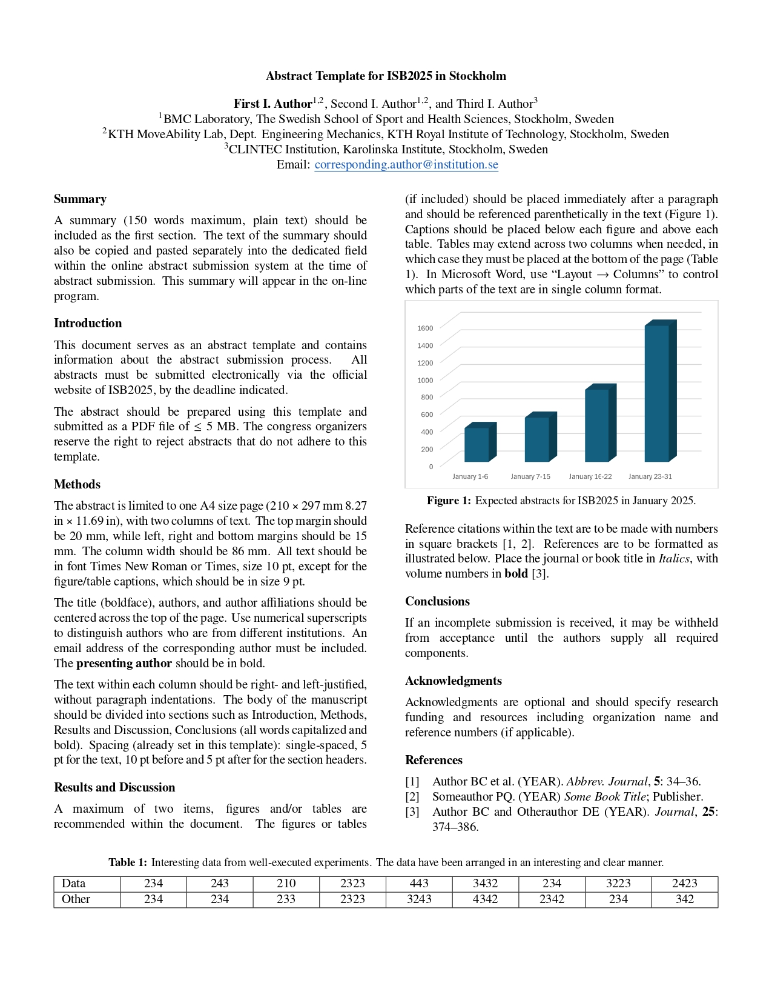

# ISB 2025 Abstract Template

A brief description of your project goes here.

This is a Latex template for ISB 2025 in Stockholm. It matches the specifications from the [provided template](https://isb2025.com/submission/). Interestingly the original template states 

`The congress organizers
reserve the right to reject abstracts that do not adhere to this
template. The abstract is limited to one A4 size page (210 × 297 mm
8.27 in × 11.69 in), with two columns of text
`

The original template is in US Letter size and not A4 size. 

## Compassion with Word Template  

Below is a comparison of the two pdfs:

| Original Word Template         | New Latex Template                          |
|---------------|--------------------------------|
|       |    |
